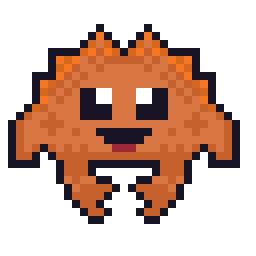

### Heya! 👋

### A bit about me

I'm deeply passionate about Rust, Python, and TypeScript, and I'm always immersed in the world of coding. Beyond that, I appreciate the art of crafting delicious dishes just as much as crafting code, and I love to expand my knowledge and skills through continuous learning.

### The vibe

:panda_face: My vibe is all about relaxation, writing quality code, sipping on tea like a true Canadian nerd, and embracing the joys of life 🍵
